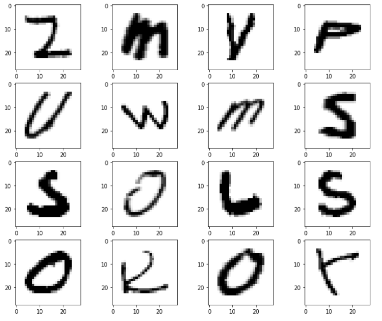
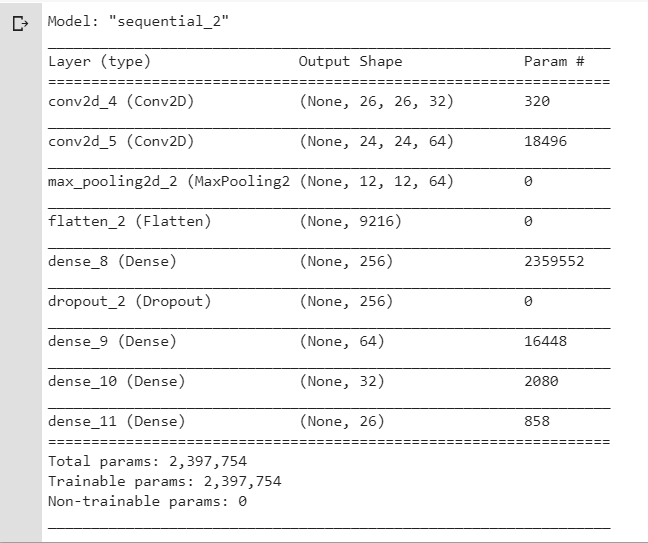

# Alphabet-Classifier [](https://www.linkedin.com/in/tirupathirao-podugu-3686b0124/)


### Description
CNN model is trained to predict the hand-written capital letters (English).
Softmax activation function is used for classifying the character set ( A to Z).

### Requirements

| Dependency | Version |
| ----------- | ------|
|Python | >3.0.x |
|Tensorflow | 2.0.0|
|Opencv2 | 4.2.0.x |

### Implementation Details

| Implementation|Details            |
| ------------- |:-------------:|
|  Tensorflow version     | 2.0.0 |
| Model | CNN|
|Transfer Learning | No
| Dataset used   | <a href="https://www.kaggle.com/sachinpatel21/az-handwritten-alphabets-in-csv-format?select=A_Z+Handwritten+Data.csv" target="_blank">**From Kaggle**</a>       |
| Optimizer | adam      |
| Regularization | Yes (Dropout)
| Data augmentation | Yes
| epochs | 20
| Training Time | 3.7h
| Evaluation Metrics | Accuracy/Loss
| Train/Validation Accuracy | 99%/99%

### Dataset 
The dataset contains 26 folders (A-Z) containing handwritten images in size 2828 pixels, each alphabet in the image is centre fitted to 2020 pixel box. Each image is stored as Gray-level



### Model Summary:

Conv2D -> Conv2D -> MaxPooling -> Flatten -> Dense -> Dropout -> Dense -> Dense -> Softmax



### Steps to execute
- 👯 Clone this repo to your local machine using `https://github.com/ThirupathRao/Alphabet-Classifier.git`

- Install all the required packages using requirements.txt
```
$ pip install requirments.txt
```
- Run Alphabet_Classifier_Run.py using below command.
```
$ python Alphabet_Classifier_Run.py 
```


### Instant Try
- [Click here](https://thirupathrao.github.io/Alphabet-Classifier/) to open the model in the web browser. (Will not work in mobile)


Feel free to connect if you are facing any issues.
##
[](./LICENSE.txt)
[](https://www.linkedin.com/in/tirupathirao-podugu-3686b0124/)

